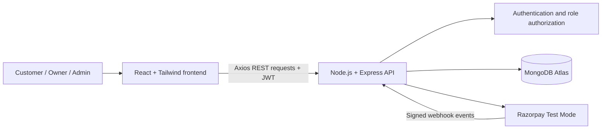

# TableReserve — Restaurant Reservation Management System

[](https://www.mongodb.com/mern-stack)
[](https://react.dev/)
[](https://expressjs.com/)
[](https://render.com/)

TableReserve is a deployed, full-stack MERN application for discovering restaurants, requesting table reservations, tracking bookings, and managing restaurant applications through role-based dashboards.

> **Portfolio disclaimer:** The restaurants, images, registration details, and business information shown in this project are fictional demo data created for educational purposes. Razorpay is integrated in **Test Mode**, so no real payments are processed.

## Live Application

- **Frontend:** [Open TableReserve](https://resturant-table-reservation-managment.onrender.com/)
- **Backend API:** [Check API status](https://restaurant-reservation-backend-godr.onrender.com/)

Render free-tier services may take a short time to wake up on the first request.

## Why This Project Matters

This project demonstrates an end-to-end production workflow rather than an isolated frontend:

- Role-based authentication for customers, restaurant owners, and administrators
- Protected REST APIs with server-side authorization
- Admin-controlled restaurant visibility and approval
- Separate booking and payment lifecycle tracking
- Razorpay order creation, signature verification, and webhook validation
- Responsive interfaces for customer, owner, and admin workflows
- Cloud deployment with managed database and environment-based configuration

## User Workflows

### Customer

- Create an account and securely sign in
- Discover featured, admin-approved restaurants by city
- Select a date, time, and party size
- Send a booking request and open Razorpay Test Checkout
- Track booking and payment statuses separately
- View profile information and securely change the account password
- Submit restaurant reviews

### Restaurant Owner

- Submit a fictional restaurant listing for administrator review
- Access a dedicated owner dashboard
- View customer requests, including unpaid Test Mode requests
- See each request's payment status
- Confirm or decline reservations

### Administrator

- Sign in through a protected admin account
- Review pending restaurant applications
- Approve or reject listings
- Keep unapproved restaurants hidden from public discovery

## Technology Stack

| Layer | Technologies |
| --- | --- |
| Frontend | React 19, Vite, Tailwind CSS, React Router, Axios |
| Backend | Node.js, Express.js, REST APIs |
| Database | MongoDB Atlas, Mongoose |
| Authentication | JSON Web Tokens, bcrypt password hashing |
| Payments | Razorpay Test Mode, signature verification, webhooks |
| Deployment | Render |

## Architecture



The frontend never receives database credentials or the Razorpay key secret. Sensitive operations—authorization, restaurant approval, order creation, payment verification, and data access—are handled by the backend.

## Security Highlights

- Passwords are hashed with bcrypt before storage
- JWT authentication protects private API routes
- Role middleware restricts owner and administrator operations
- Public restaurant queries return only approved listings
- Password changes require the current password and a new password of at least 12 characters
- Razorpay payment signatures are verified server-side
- Razorpay webhook signatures are validated using the raw request body
- CORS is restricted using the configured frontend URL
- Secrets are loaded from environment variables and excluded from Git

## Payment and Booking Flow

1. A customer selects reservation details and clicks **Proceed to Pay**.
2. The backend validates the restaurant, date, time, and party size.
3. The backend creates a Razorpay Test order and stores the booking request.
4. The restaurant receives the request even if Test Checkout is closed or payment fails.
5. Successful payments are verified on the server before the payment status becomes `paid`.
6. The restaurant independently confirms or declines the table request.

This design intentionally treats **payment status** and **restaurant confirmation status** as separate states.

## Project Structure

```text
Resturant-Reservation-Managment-System/
├── Resturant_project_frontend/   # React, Vite, Tailwind CSS
│   ├── public/
│   └── src/
└── Resturant_project_backend/    # Express API, Mongoose models
    ├── scripts/
    ├── src/
    │   ├── config/
    │   ├── controllers/
    │   ├── middleware/
    │   ├── models/
    │   └── routes/
    └── server.js
```

## Run Locally

### Prerequisites

- Node.js and npm
- A MongoDB database
- Razorpay Test Mode keys for payment testing

### 1. Clone the repository

```bash
git clone https://github.com/Nishant7621/Resturant-Reservation-Managment-System.git
cd Resturant-Reservation-Managment-System
```

### 2. Configure and start the backend

Create `Resturant_project_backend/.env`:

```env
MONGO_URI=your_mongodb_connection_string
JWT_SECRET=your_long_random_jwt_secret
CLIENT_URL=http://localhost:5173
RAZORPAY_KEY_ID=your_test_key_id
RAZORPAY_KEY_SECRET=your_test_key_secret
RAZORPAY_WEBHOOK_SECRET=your_webhook_secret

ADMIN_NAME=Administrator
ADMIN_EMAIL=your_admin_email
ADMIN_PASSWORD=your_strong_admin_password
```

Then run:

```bash
cd Resturant_project_backend
npm install
npm run create-admin
npm run dev
```

The backend runs at `http://localhost:5000`.

### 3. Configure and start the frontend

Create `Resturant_project_frontend/.env`:

```env
VITE_API_URL=http://localhost:5000/api
```

Then run:

```bash
cd Resturant_project_frontend
npm install
npm run dev
```

The frontend runs at `http://localhost:5173`.

> Keep every `.env` file outside `src`, and never commit real secrets or account credentials.

## Available Commands

### Frontend

```bash
npm run dev
npm run lint
npm run build
npm run preview
```

### Backend

```bash
npm run dev
npm start
npm run create-admin
```

## Key Engineering Decisions

- **Admin approval:** New restaurant listings remain hidden until explicitly approved.
- **Server-calculated fees:** The backend calculates booking amounts instead of trusting client input.
- **Separated states:** A successful payment does not automatically mean the restaurant accepted the booking.
- **Protected ownership:** Restaurant owners can manage requests only for their own restaurant.
- **Demo-safe onboarding:** Restaurant registration asks for fictional educational data rather than real confidential business information.

## Future Improvements

- Email notifications for booking decisions
- Password-reset flow with expiring tokens
- Rate limiting and additional HTTP security headers
- Automated API and end-to-end tests
- Image upload through managed object storage
- Pagination and advanced search filters
- Razorpay Live Mode after business and website verification

## What I Learned

Building TableReserve strengthened my practical understanding of:

- Designing and consuming REST APIs
- Modelling related data with MongoDB and Mongoose
- Authentication and role-based authorization
- Payment order and webhook workflows
- Responsive React interface development
- Environment management and cloud deployment
- Debugging integration issues across a complete full-stack application

## Author

**Nishant Jha**

Feedback and suggestions are welcome.
